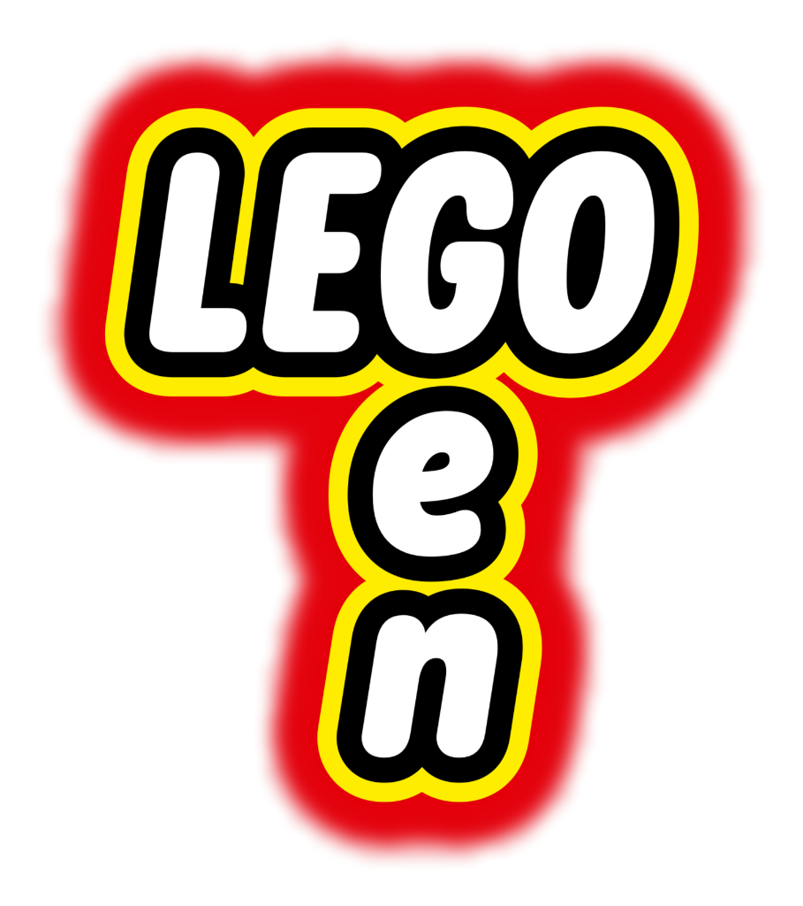

# LEGO-gen


**LEGO-gen** is a probabilistic generative model implemented in *Gen.jl*, designed to reconstruct 3D LEGO structures from 2D observations.

### Overview
The project compares a baseline method, Sequential Metropolis-Hastings, with a cognitively inspired layer-wise approach that mimics human strategies for building LEGO models. The layer-wise method demonstrates improved efficiency and accuracy in reconstructing complex structures.

### Project Structure

```text
LEGO-gen/
├── lego-gen_model.ipynb    # Main notebook to run experiments
├── src/ 
│   ├── LegoStructures.jl   # Functions to load target structures
│   ├── LegoFunctions.jl    # Generative model and related functions
│   ├── BrickVocabulary.jl  # Function to plot the brick vocabulary
│   ├── PostProcessing.jl   # Visualization and plotting functions
│   └── scene_setup.py      # Scene setup
├── bricks/                 # Brick vocabulary .obj files
├── outputs/                # Animations (.gifs)
└── docs/                   # Presentation and report
```


